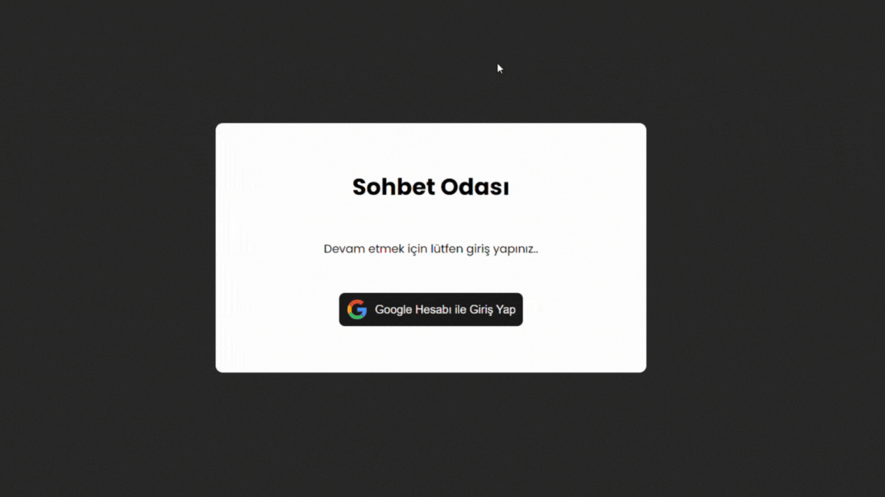

# Chat Application

This project is a chat application that stores data in Firebase and allows users to log in with their Google accounts. Users can select different rooms and switch between them.

## Features

- Google account authentication
- Create and switch between different chat rooms
- Real-time message storage and retrieval with Firebase
- User-friendly interface

## Usage

- Upon launching the application, log in with your Google account.
- After logging in, you can create new rooms or join existing ones.
- Type and send messages, which will be shared in real-time with other users.

### GIF

